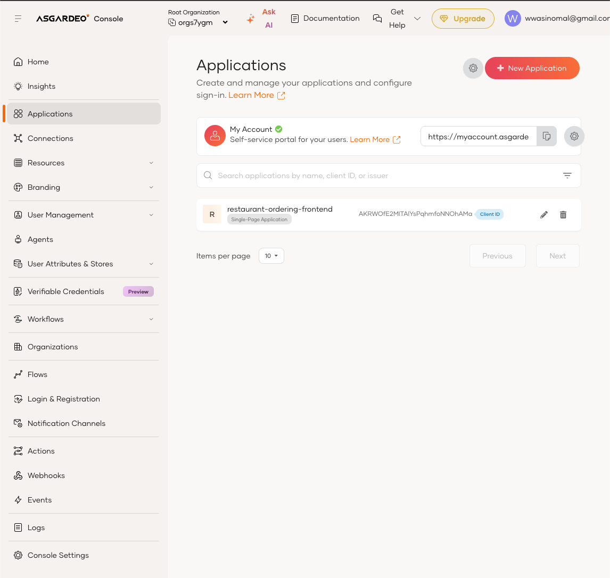
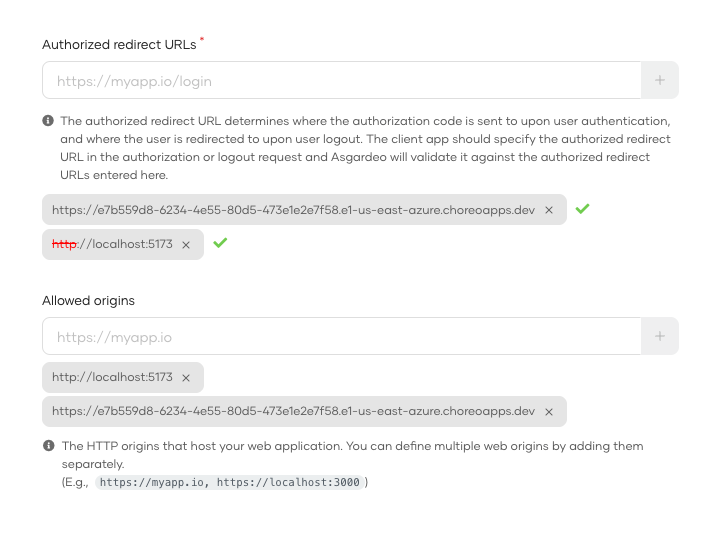
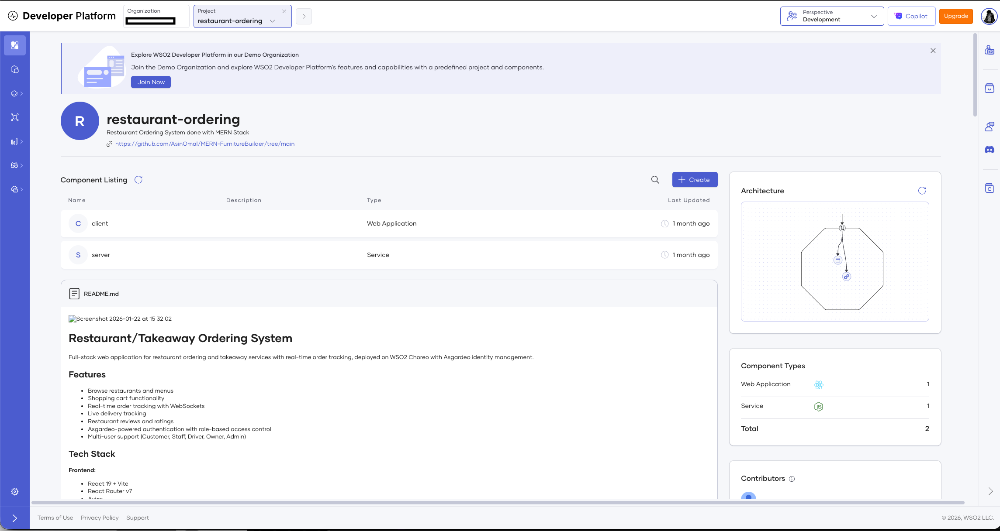
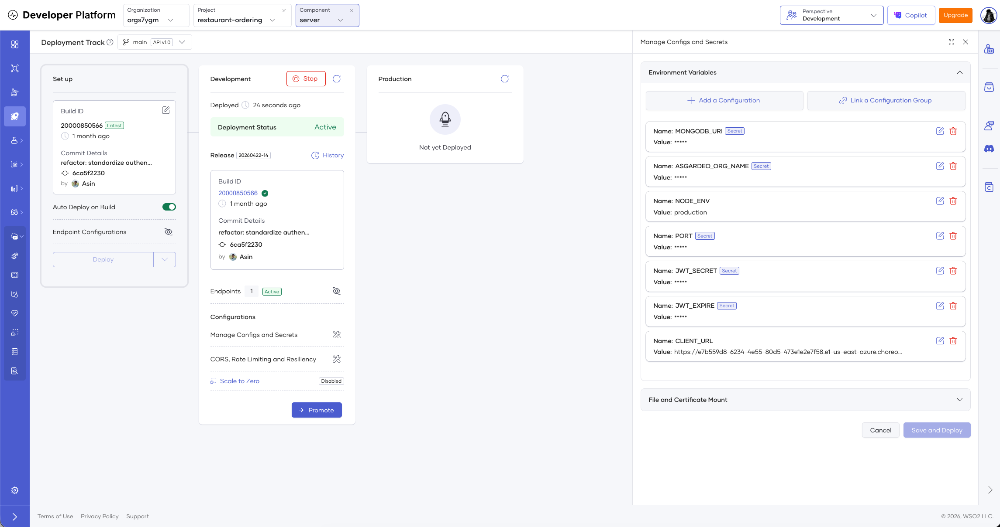
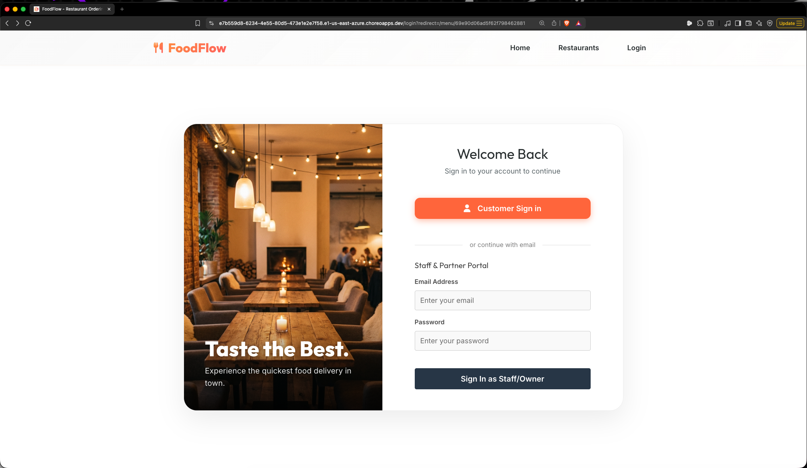
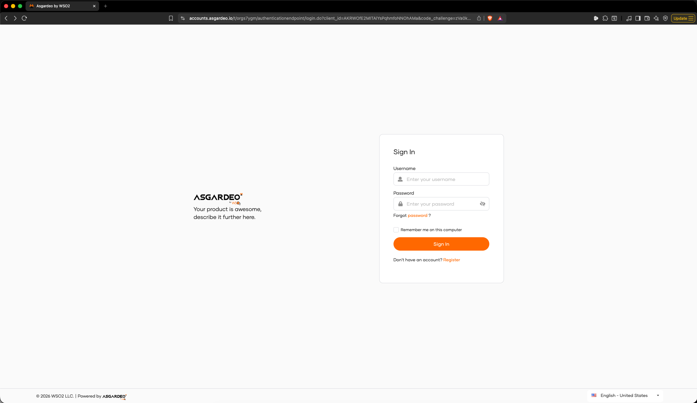
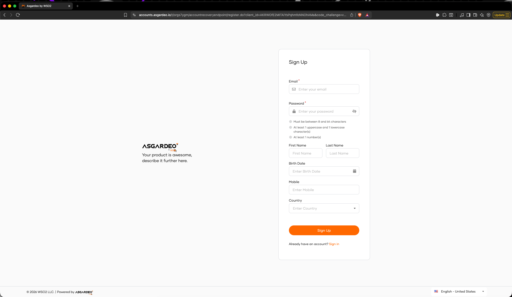

# FoodFlow — Multi-Role Food Delivery on WSO2

A MERN food-ordering app with real-time order and delivery tracking over WebSockets, five user roles (customer, staff, driver, owner, admin), menu image uploads, and per-role dashboards. Authentication and deployment are both handled by WSO2 products.

**Live app:** https://e7b559d8-6234-4e55-80d5-473e1e2e7f58.e1-us-east-azure.choreoapps.dev

> This file is intentionally separate from `README.md`. The README covers how to develop the code locally. This file's only job is to show a WSO2 reviewer — in about 30 seconds — what the app is, which WSO2 products power it, and how to see it running. Heads-up: the live link runs on Choreo's free tier, so the first request after idle can take ~30s to cold-start. That's the platform, not a broken link.

---

## WSO2 Products Used

### Asgardeo — Identity & Access

Asgardeo is the only auth provider in the app. There is no `/login` or `/register` endpoint on the backend and no passwords stored in MongoDB.

**Frontend wiring** (`client/src/main.jsx`, `client/src/asgardeoConfig.js`):
- App is wrapped in `<AsgardeoProvider>` from `@asgardeo/react` v0.23.
- Config (`clientId`, `baseUrl`, sign-in redirect) is read from `window.env` at runtime — see the Choreo section for why — with `import.meta.env` as a local-dev fallback.
- Sign-in, sign-out, and the current user are accessed through the SDK's React hooks, then mirrored into a thin `AuthContext` so the rest of the components don't depend on the SDK directly.

**Backend wiring** (`server/src/middleware/asgardeo.middleware.js`):
- No symmetric secrets. Tokens are verified against Asgardeo's JWKS endpoint using `jwks-rsa`, with `RS256` enforced explicitly in `jwt.verify`.
- The five roles (`customer`, `staff`, `driver`, `owner`, `admin`) are read from a claim on the decoded JWT, then enforced per-route by an `authorize(...roles)` middleware layered after `protect`.

**Reviewer note:** the sign-in and sign-out redirect URLs in the Asgardeo console must match the deployed Choreo URL *exactly* — even a trailing slash will break login in production while working locally.

### Choreo — Build & Deployment

The whole app runs on Choreo, deployed as two components inside a single project:

| Component | Type | Source | Notes |
|---|---|---|---|
| `server` | Service (Node.js) | `server/Dockerfile` | Mongoose → MongoDB Atlas, Socket.io for real-time order and delivery rooms |
| `client` | Web App (React) | `client/Dockerfile` + `client/nginx.conf` | Static Vite build served by nginx |

**Configs & Secrets** — Mongo URI, Asgardeo client ID and org name, and the backend API base URL all live in Choreo's Configs & Secrets UI. Nothing sensitive is committed to the repo.

**Runtime config injection for the SPA** — Vite bakes `import.meta.env` at build time, but Choreo's environment values are only resolved at deploy time. The pattern I used: `client/public/config.js` defines a `window.env` object that Choreo overwrites with the real URLs at deploy. `asgardeoConfig.js` and `services/api.js` both read from `window.env` first, so the same built image works in dev, staging, and prod with no rebuild.

**Reviewer note:** the frontend calls the backend through Choreo's API gateway URL (the `*.choreoapis.dev` host with `/restaurant-ordering/server/v1.0` in the path), not the Service component directly. The gateway handles CORS and TLS termination.

---

## Tech Stack

**Asgardeo** · **Choreo** · MongoDB Atlas · Express 5 · React 19 · Node · Vite · Socket.io · Mongoose · jwks-rsa · Docker · nginx

---

## Architecture at a Glance

```
            ┌──────────────────────────────────────────┐
            │                Asgardeo                  │
            │     (login redirect · JWT issuance)      │
            └──────────────┬───────────────────────────┘
                           │ RS256 JWT
                           ▼
 ┌─────────────┐   HTTPS   ┌────────────────┐   HTTPS   ┌────────────────┐
 │   Browser   │ ────────► │ Choreo: client │ ────────► │ Choreo: server │
 │  (React 19) │ ◄──────── │  (nginx + SPA) │ ◄──────── │ (Node/Express) │
 └─────────────┘  Socket   └────────────────┘  (JWKS    └───────┬────────┘
        ▲          .io                         verify)          │
        │                                                       ▼
        └────────── real-time order/delivery updates     MongoDB Atlas
```

---

## Screenshots

### Asgardeo console — registered SPA


### Asgardeo console — allowed redirect URLs


### Choreo — both components in the project


### Choreo — Configs & Secrets for the server component


### Live app — FoodFlow login page


### Asgardeo-hosted sign-in portal (after redirect)


### Asgardeo-hosted register portal


---

## What I Learned

- **A trailing slash between the Asgardeo callback URL and the Choreo URL silently breaks login in production.** It worked locally, broke once deployed, and gave no useful error. Fix: copy the deployed Choreo URL into Asgardeo's allowed sign-in and sign-out URLs character-for-character.
- **Vite environment variables are baked in at build time, which is wrong for Choreo.** My first deploy worked, then broke the moment I needed a different prod value without rebuilding. The `window.env` shim in `public/config.js` (overwritten by Choreo at runtime) means one built image is portable across environments.
- **The free-tier MongoDB Atlas cluster will pause itself, and when it does the `mongodb+srv://` SRV record disappears.** Choreo logs surfaced `querySrv ENOTFOUND` and I almost blamed Choreo for it. Resuming the cluster in Atlas fixed it immediately.
- **Removing the `/login` endpoint felt strange at first.** All credential handling moved out of my code into Asgardeo; my backend's job became "verify this JWT and read the role claim." The user collection now only holds app data (addresses, order history), not auth state.
- **Choreo's `component.yaml` is small but unforgiving.** Wrong port or wrong component type produces a silent failure with no useful logs. Getting that file right was the difference between a clean deploy and an hour of guessing.

---

## Running Locally

Full developer setup is in `README.md`. The minimum to see it run:

```bash
# server
cd server && cp .env.example .env && npm install && npm run dev

# client (separate terminal)
cd client && npm install && npm run dev
```

Then visit http://localhost:5173.
