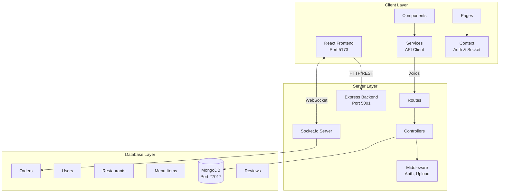
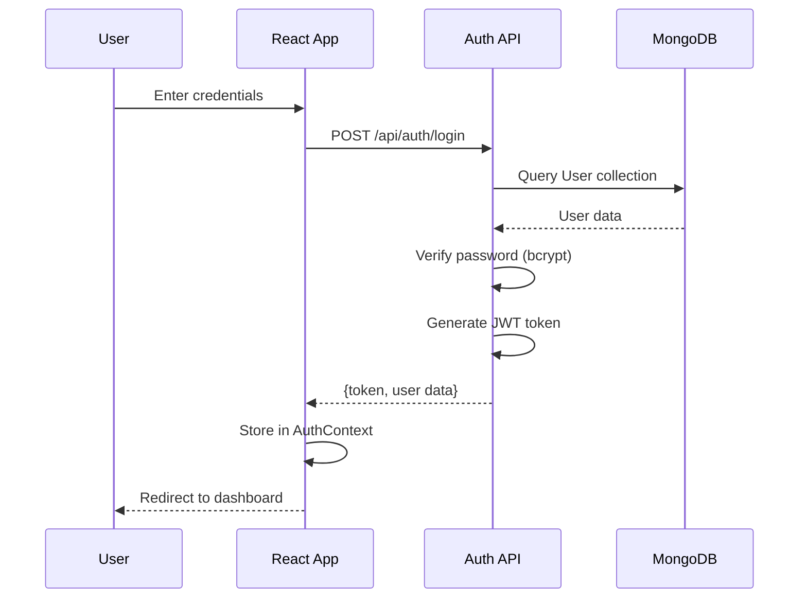
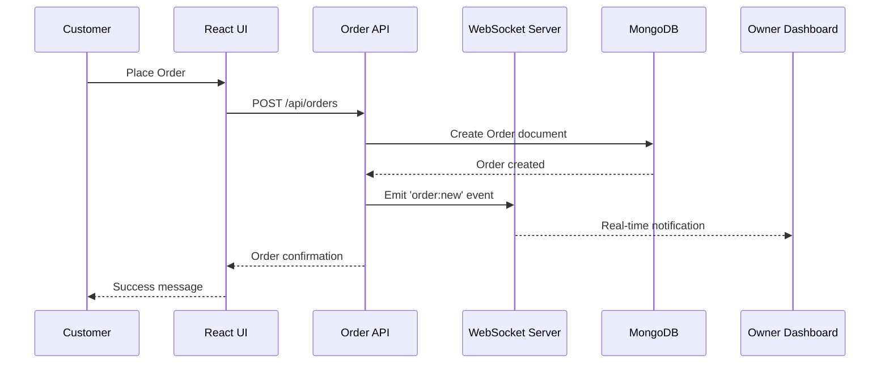
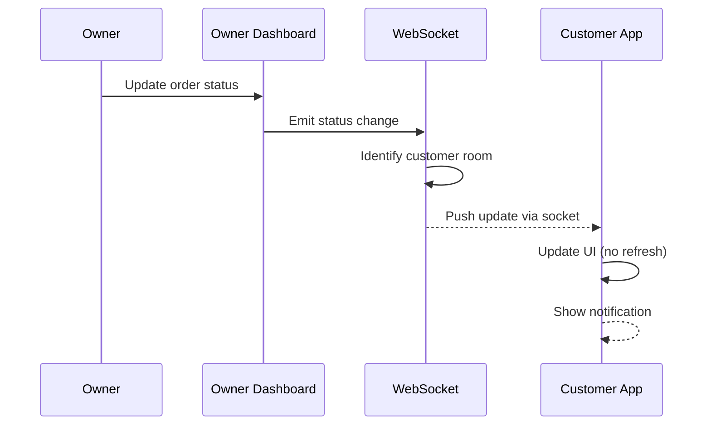
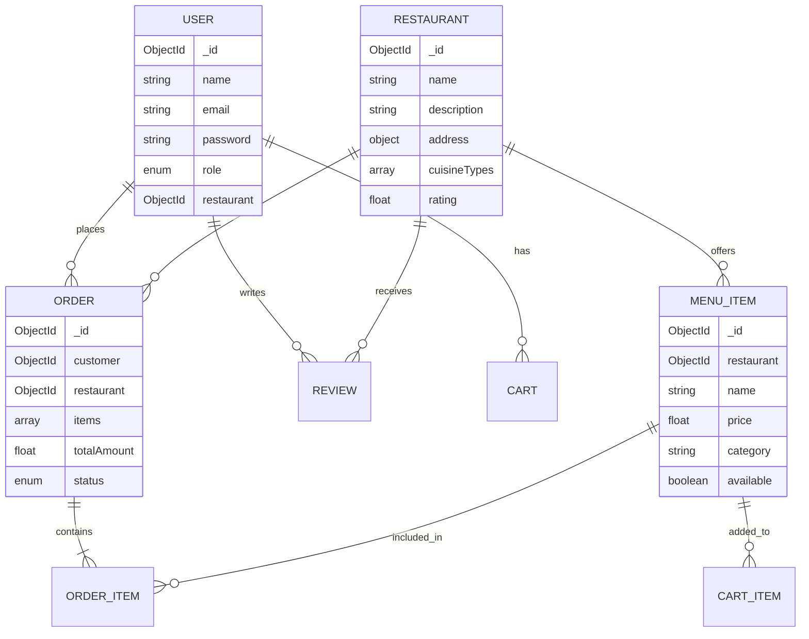
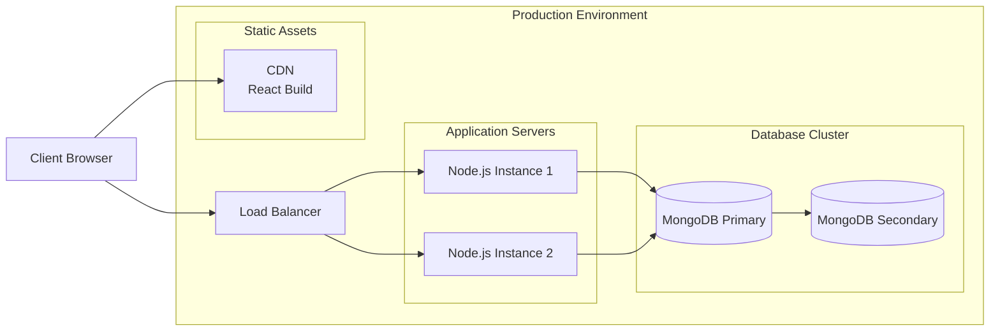

# System Architecture

## Overview
FoodFlow is a full-stack MERN (MongoDB, Express, React, Node.js) application with real-time features powered by WebSockets.

---

## High-Level Architecture

---

## Component Interaction Flow

### 1. User Authentication Flow

### 2. Order Placement Flow

### 3. Real-Time Order Updates

---

## Data Models

### Core Entities

---

## Technology Stack

### Frontend
- **Framework**: React 18
- **Build Tool**: Vite
- **Routing**: React Router DOM v6
- **HTTP Client**: Axios
- **Real-time**: Socket.io Client
- **Charts**: Recharts
- **Styling**: Vanilla CSS with custom variables

### Backend
- **Runtime**: Node.js 18+
- **Framework**: Express 5
- **Database**: MongoDB with Mongoose ODM
- **Authentication**: JWT (jsonwebtoken)
- **Password Hashing**: bcrypt
- **Real-time**: Socket.io
- **File Upload**: Multer
- **Security**: Helmet, CORS

### DevOps
- **CI/CD**: GitHub Actions
- **Testing**: Jest, Supertest
- **Linting**: ESLint
- **Containerization**: Docker

---

## Deployment Architecture

---

## Security Measures

### Authentication & Authorization
- JWT tokens with 24h expiration
- HTTP-only cookies for token storage
- Role-based access control (Customer, Staff, Owner, Admin)
- Protected routes with middleware

### Data Protection
- Password hashing with bcrypt (10 rounds)
- Input validation with express-validator
- XSS protection with Helmet
- CORS configuration for trusted origins

### API Security
- Rate limiting (future enhancement)
- Request sanitization
- Secure headers via Helmet
- Environment variable protection

---

## Performance Optimizations

### Frontend
- Code splitting with React.lazy()
- Image optimization (WebP format)
- Lazy loading for images
- React Context for state management (avoiding prop drilling)

### Backend
- Database indexing on frequently queried fields
- Mongoose lean queries for read-only operations
- Connection pooling for MongoDB
- Efficient aggregation pipelines for analytics

### Real-Time
- Socket.io rooms for targeted broadcasts
- Event-based architecture (no polling)
- Automatic reconnection handling

---

## Scalability Considerations

### Horizontal Scaling
- Stateless API design
- Session data in JWT (no server-side sessions)
- Socket.io Redis adapter for multi-instance WebSocket support

### Database Scaling
- MongoDB replica sets for high availability
- Sharding strategy for large datasets
- Read replicas for analytics queries

### Caching Strategy (Future)
- Redis for session storage
- CDN for static assets
- API response caching for public endpoints

---

## Monitoring & Logging

### Application Monitoring
- Morgan for HTTP request logging
- Console logging with color-coded levels
- Error tracking middleware

### Future Enhancements
- Winston for structured logging
- Prometheus for metrics collection
- Grafana for visualization
- Sentry for error tracking
